# 📦 庫存管理系統（C# Windows Forms）

> **明新科大 視窗設計課程期末報告**  
> Windows Forms 應用程式 — 庫存管理系統  

> ✏️ **專案作者**  
> 林芳伃（N10170002）  
> 孫毓廷（N10170016）

---

## 📚 系統簡介

一款輕量、直覺且實用的庫存管理工具，採用 Windows Forms（.NET Framework）開發。支援零件建檔、入庫/出庫管理、操作紀錄查詢、關鍵字與時間區間篩選等功能，並使用 JSON 進行資料儲存，方便快速部署與使用。

---

## 🧩 系統特色

- ✅ 新增、編輯、刪除零件資料
- 📥 入庫 / 📤 出庫動作管理
- 🧾 詳細的操作紀錄查詢
- 🔍 關鍵字與時間區段篩選
- 📁 使用 JSON 進行本地資料儲存（`parts.json` / `history.json`）
- 🖥️ 三分頁直覺式操作介面：**總覽 / 管理 / 歷史紀錄**

---

## 🖼️ 操作畫面示意

### 🎛️ 主畫面（三分頁）

| 庫存總覽 | 庫存管理 | 歷史紀錄 |
|---------|---------|---------|
| 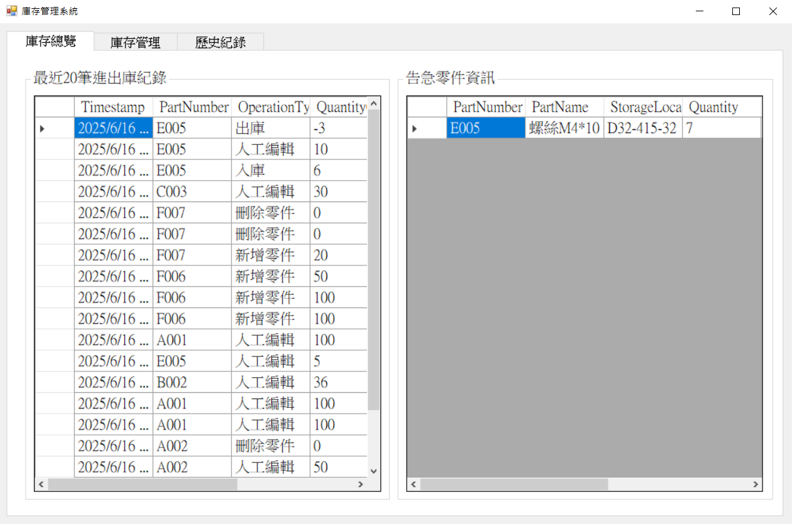 | 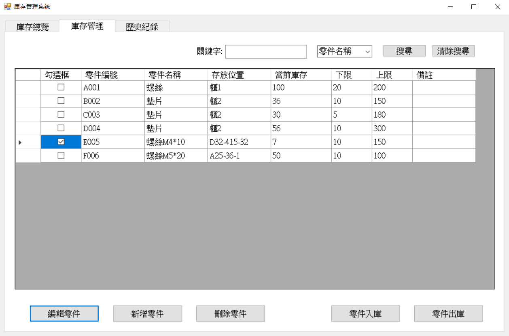 | 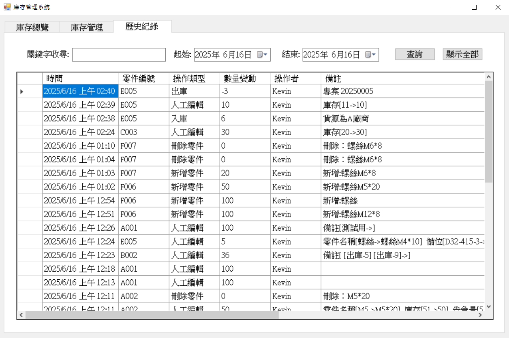 |

### ➕ 新增零件操作 / ✏️ 編輯零件操作

| 新增零件 | 編輯零件 |
|---------|---------|
| 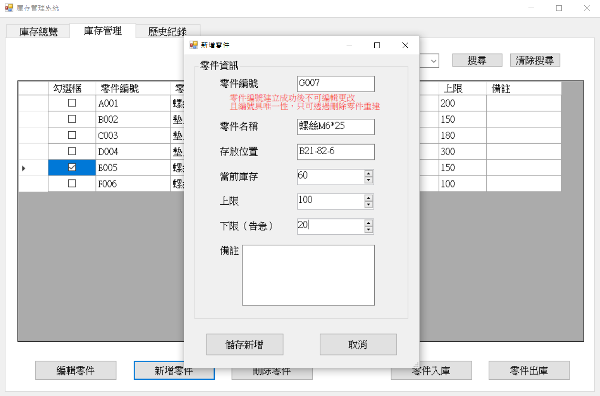 | 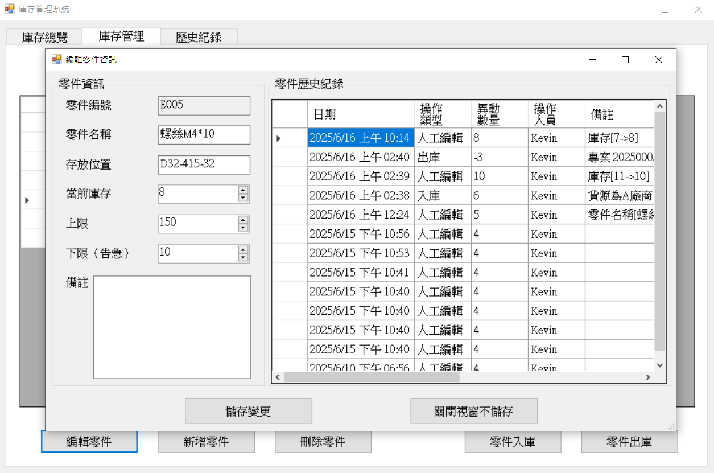 |
| 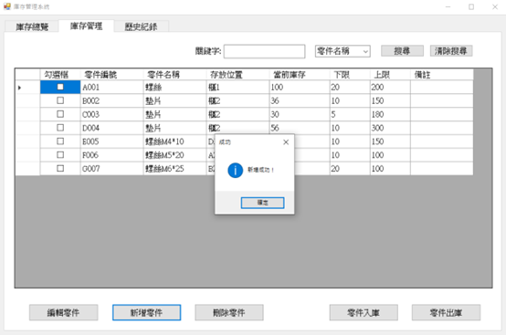 | 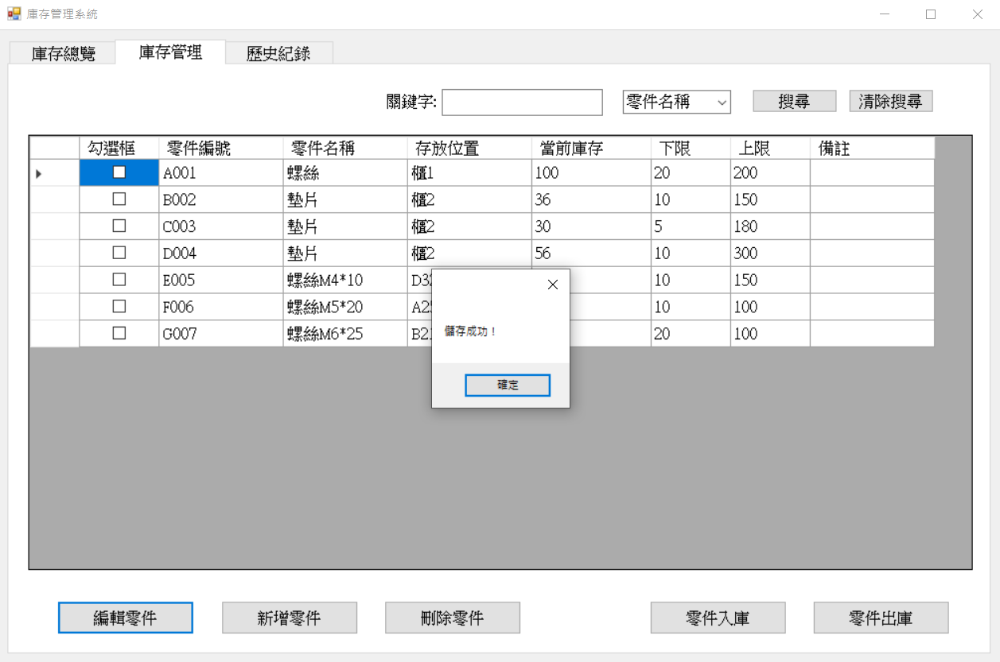 |

### 📥 入庫操作 / 📤 出庫操作

| 入庫 | 出庫 |
|------|------|
| 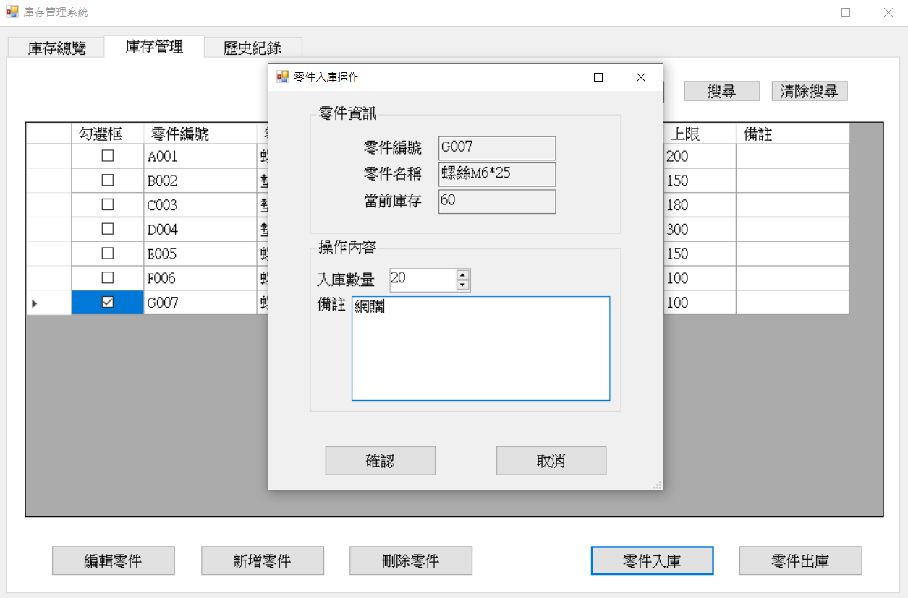 | 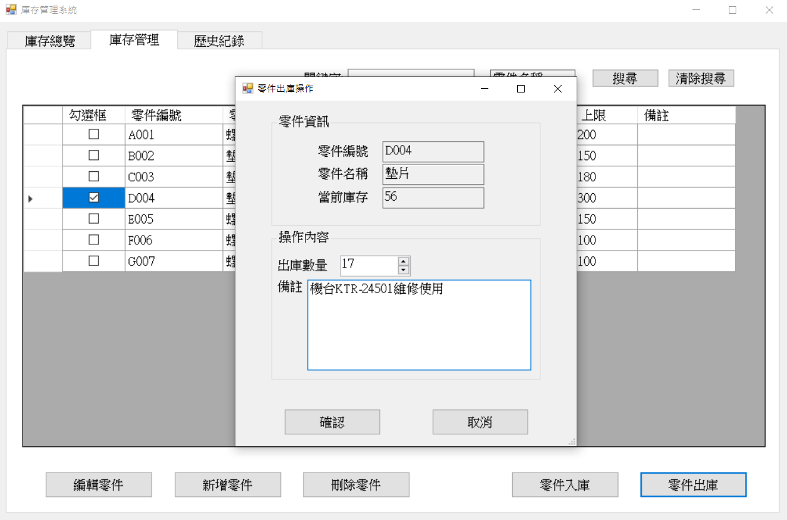 |
| 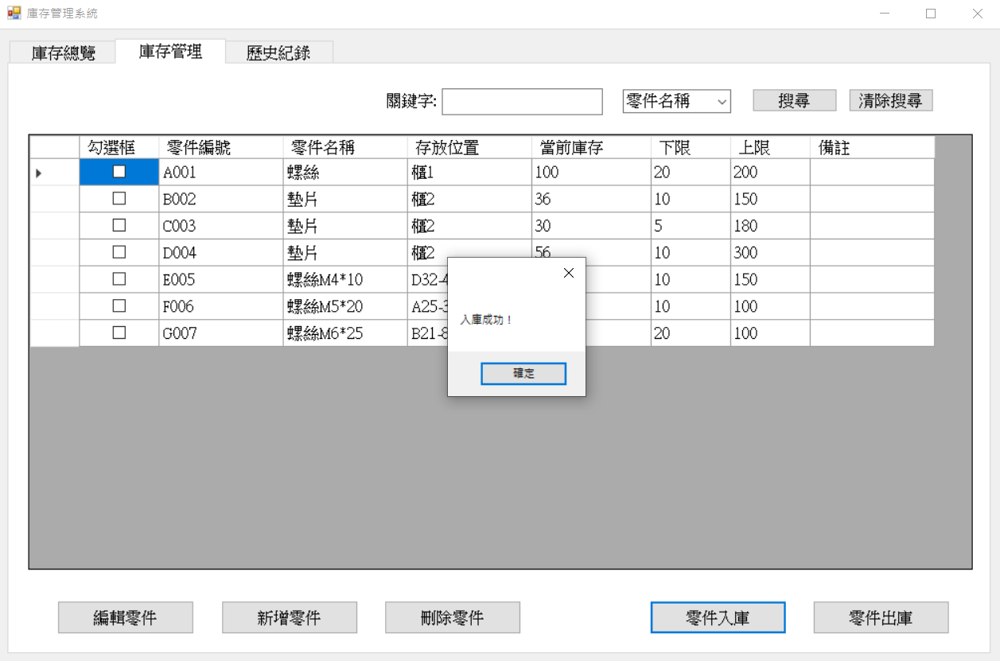 |  |

### 🔍 關鍵字搜尋 / 日期範圍搜尋

| 庫存管理 (可選擇欄位搜尋關鍵字) | 歷史查詢（可選擇日期範圍查詢關鍵字） |
|------|------|
|  | 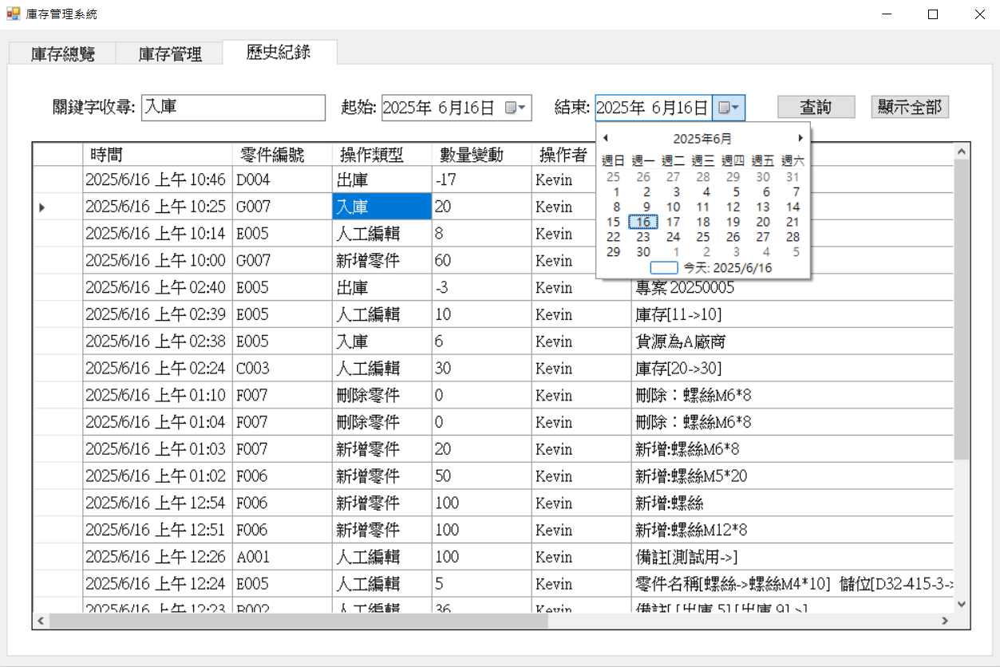 |
| 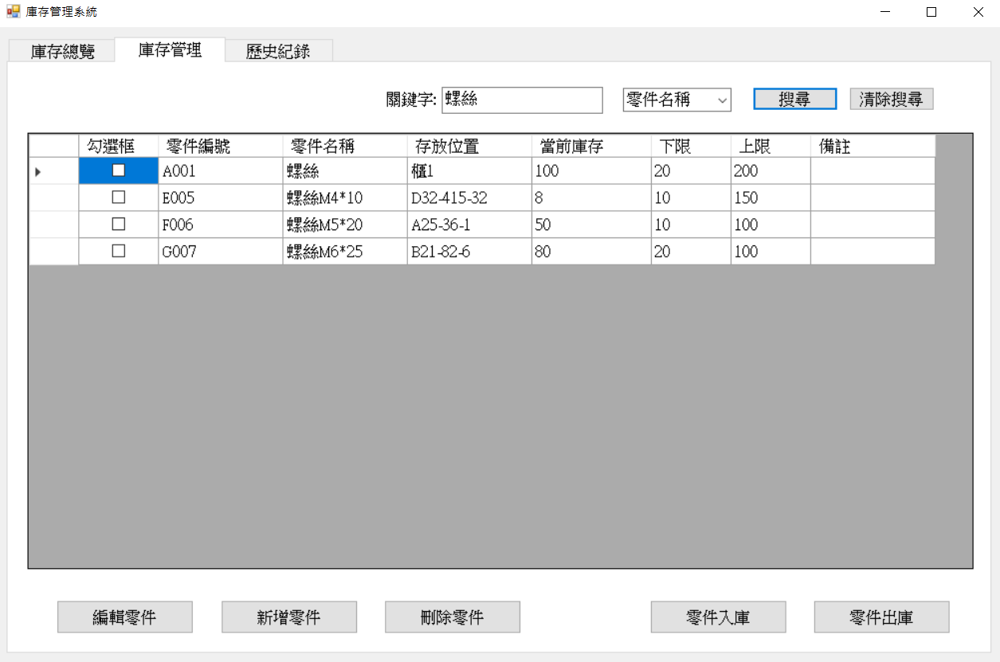 | 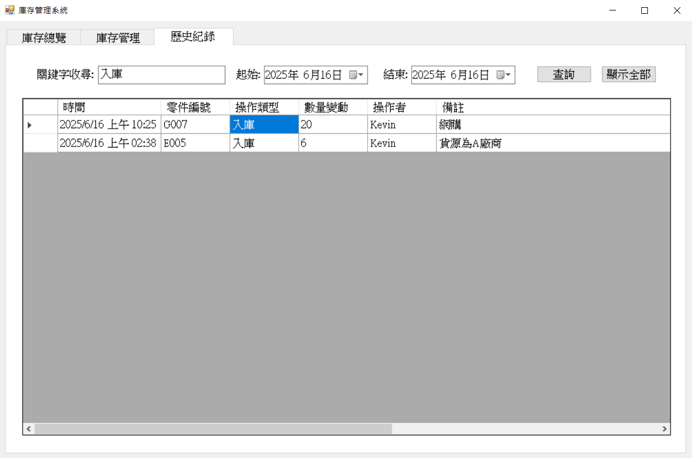 |

---

## ⚙️ 系統架構圖

```
+--------------------------+
|    Windows Forms GUI     | ← 使用者操作介面
+------------+-------------+
             ↓
+--------------------------+
|     邏輯與事件處理層      | ← 按鈕事件、資料顯示邏輯
+------------+-------------+
             ↓
+--------------------------+
|     JSON 資料儲存層       | ← parts.json / history.json
+--------------------------+
```

---

## 📁 專案結構簡介

```
InventoryManager/
├── Form1.cs               # 主介面與三分頁邏輯
├── FormAddPart.cs         # 新增零件視窗
├── FormEditPart.cs        # 編輯零件與歷史視窗
├── FormStockInEdit.cs     # 入庫操作視窗
├── FormStockOutEdit.cs    # 出庫操作視窗
├── parts.json             # 零件資料儲存
├── history.json           # 操作紀錄儲存
├── screenshots/           # 操作截圖資料夾
└── README.md              # 專案說明文件
```

---

## 🛠 開發環境

- 🧰 開發工具：Visual Studio 2022
- 🧱 .NET Framework：4.8
- 💾 JSON 處理：`System.Text.Json`

---

## 🚀 使用說明

這裡提供三種方式快速開始使用程式：

### 方法一：下載可執行檔

下載整個 `bin/Debug` 資料夾，直接執行其中的 `InventoryManager.exe`。

🔗 [點此下載](https://github.com/n159951357753/MUST-SoftWindowDesign/tree/main/期末專題報告2-庫存管理系統/src/InventoryManager/InventoryManager/bin/Debug)

---

### 方法二：下載壓縮檔

下載 `Debug.zip`，解壓縮後執行 `InventoryManager.exe`。

🔗 [點此下載壓縮檔](https://github.com/n159951357753/MUST-SoftWindowDesign/tree/main/期末專題報告2-庫存管理系統/src/InventoryManager/InventoryManager/bin/Debug/Debug.zip)

---

### 方法三：下載並建置原始碼

1. 複製程式碼：
   ```bash
   git clone https://github.com/n159951357753/MUST-SoftWindowDesign.git
   ```
2. 使用 Visual Studio 開啟方案：  
   `MUST-SoftWindowDesign/期末專題報告2-庫存管理系統/src/InventoryManager`
3. 點擊建置並執行專案
4. 開始使用圖形介面進行零件與庫存管理

---

## ✅ 注意事項

- 如遇錯誤，請以 **系統管理員模式** 開啟 Visual Studio
- 外部資源或 DLL 可放於 `src/Libs/` 資料夾
- 若需清除所有資料，可刪除 `parts.json` 與 `history.json`

---

## 🔭 未來規劃

- 支援 SQLite 或雲端資料庫儲存
- 加入使用者登入與權限控管功能
- 推出手機查詢版本，支援現場快速查詢與操作

---

## 📝 授權條款

MIT License © 2025 林芳伃
