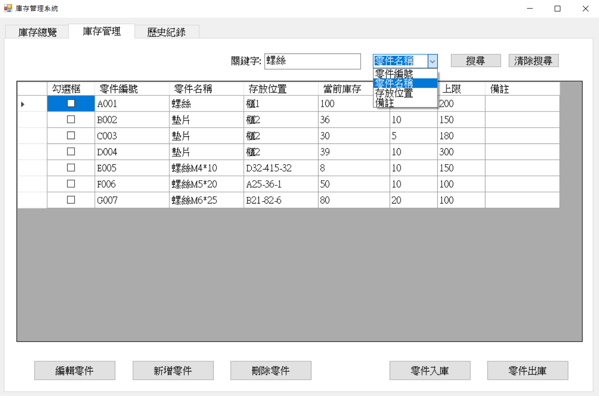

# 📦 庫存管理系統（C# Windows Forms）


> **明新科大 視窗設計課程期末報告**  
> Windows Forms 應用程式 — 庫存管理系統

> ✏️ **專案作者**  
> [ 林芳伃 N10170002 ]
> [ 孫毓廷 N10170016 ]


## 📚 系統簡介
一款輕量且實用的庫存管理工具，採用 Windows Forms（.NET）開發。支援零件登錄、入庫/出庫操作、操作紀錄查詢、關鍵字與時間範圍過濾，並使用 JSON 檔案儲存資料。

## 🧩 系統特色

- ✅ 新增 / 編輯 / 刪除 零件資料
- 📥 入庫 / 📤 出庫 管理操作
- 🧾 完整的歷史操作紀錄追蹤
- 🔍 關鍵字與日期篩選功能
- 📁 使用 JSON 格式進行本地資料儲存（parts.json / history.json）
- 👁️ 直覺式三分頁介面：總覽 / 管理 / 歷史紀錄


## 🖼️ 操作畫面示意

### 🎛️ 主畫面 – 三分頁

| 庫存總覽 | 庫存管理 | 歷史紀錄 |
|---------|---------|---------|
|  |  |  |

### ➕ 新增零件 / ✏️ 編輯零件

| 新增零件 | 編輯零件 |
|---------|---------|
|  |  |
|  |  |

### 📥 入庫 / 📤 出庫

| 入庫 | 出庫 |
|------|------|
|  |  |
|  |  |

### 🔍 關鍵字與日期篩選功能

| 庫存管理(可篩選關鍵字範圍) | 歷史查詢(可篩選關鍵字與時間範圍) |
|------|------|
|  |  |
|  |  |


## ⚙️ 系統架構

```
+-------------------------+
|   Windows Forms GUI     | ← 前端介面
+-----------+-------------+
            ↓
+-------------------------+
|    事件處理與邏輯層       | ← 按鈕邏輯、資料綁定
+-----------+-------------+
            ↓
+-------------------------+
|   JSON 資料儲存層        | ← parts.json / history.json
+-------------------------+
```


## 🧱 專案結構

```
InventoryManager/
├── Form1.cs                 # 主介面與三分頁邏輯
├── FormAddPart.cs           # 新增零件視窗
├── FormEditPart.cs          # 編輯零件與歷史紀錄視窗
├── FormStockInEdit.cs       # 入庫操作視窗
├── FormStockOutEdit.cs      # 出庫操作視窗
├── parts.json               # 零件資料存檔
├── history.json             # 歷史紀錄存檔
├── README.md                # 本說明文件
└── screenshots/             # 畫面截圖資料夾
```


## 🛠 開發環境

- 🧰 開發工具：Visual Studio 2022
- 🧱 .NET Framework：4.8
- 💾 資料格式：System.Text.Json 處理 JSON 讀寫


## 🚀 使用說明

- 複製或下載整個debug資料夾，並直接執行其中的 InventoryManager.exe
   ```bash
   https://github.com/n159951357753/MUST-SoftWindowDesign/tree/main/期末專題報告2-庫存管理系統/src/InventoryManager/InventoryManager/bin/Debug
   ```

- 或按照下方步驟下載並執行專案原始碼
1. 複製專案程式碼：
   ```bash
   git clone https://github.com/n159951357753/MUST-SoftWindowDesign.git
   ```
2. 使用 Visual Studio 開啟方案: MUST-SoftWindowDesign/期末專題報告2-庫存管理系統/src/InventoryManager
3. 建置並執行專案
4. 開始使用圖形介面進行零件與庫存管理


## ✅ 注意事項

- 若出現權限或載入資源錯誤，請確保以管理員模式執行 Visual Studio
- 若有外部 DLL 或資源請放入 `src/Libs/` 內
- 刪除文件夾內的 `parts.json` 與 `history.json` 可以清除全部零件與歷史的資料紀錄


## 📌 未來規劃

- 支援 SQLite 或雲端資料庫，增強擴充性與穩定性
- 增加使用者登入與權限控管
- 推出手機查詢版本，便於現場操作與查詢

## 📝 授權條款

MIT 授權條款 © 2025 林芳伃
